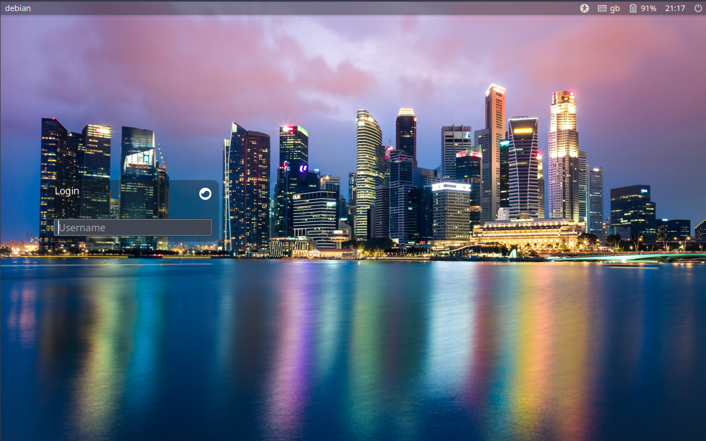
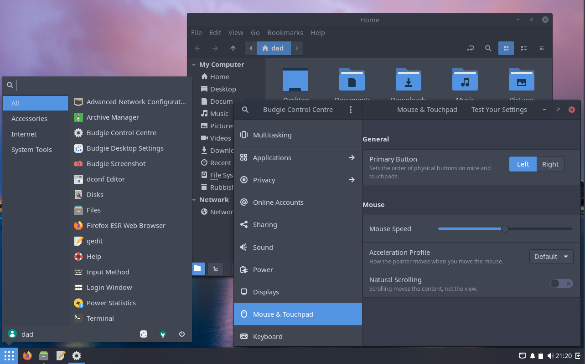

# Budgie Desktop environment customisation for Debian
 Installs packages, both essential dependencies
 as well as recommended packages to produce a useful and
 integrated desktop.
 
 The principles followed are to adhere to upstream budgie
 recommendations coupled with ensuring a minimal but useful set
 of Debian defaults.
 
 Installs:
   Debian Budgie panel configuration
   gsettings overrides
   applies the default Gtk+ theme & icon-theme for GTK+
   applications

